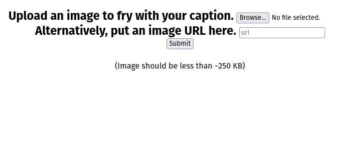
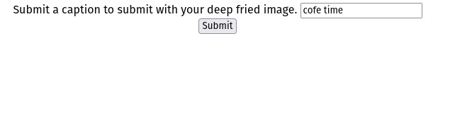
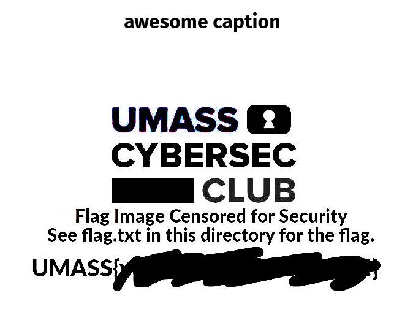
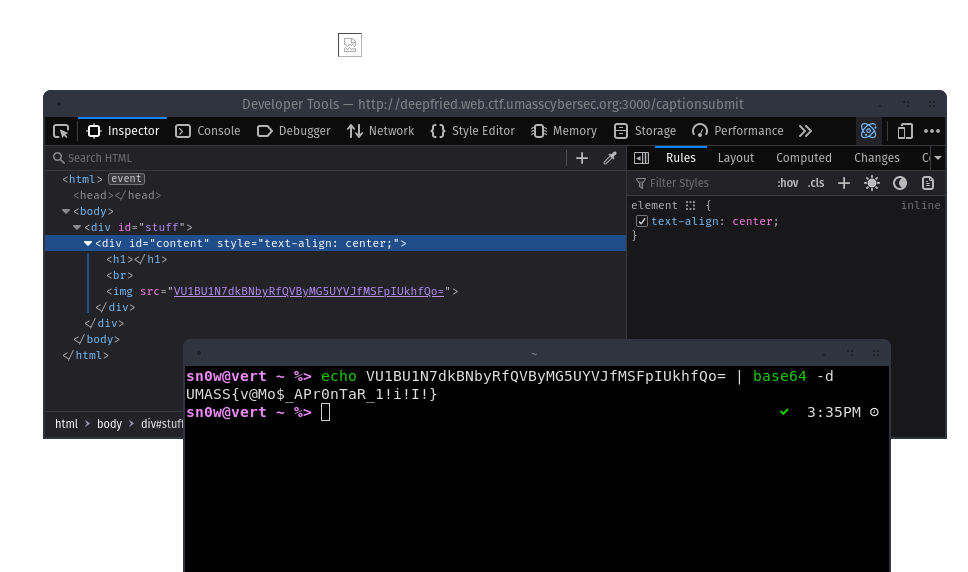

# UMass 2023 - deepfried

## 💙 Description

> Show off your class with this deep fried meme generator!
>
> Site: [https://deepfried.web.ctf.umasscybersec.org:3000](https://deepfried.web.ctf.umasscybersec.org:3000)
>
> Source: [https://umass-ctf-challenges.s3.amazonaws.com/web/DeepFried.zip](https://umass-ctf-challenges.s3.amazonaws.com/web/DeepFried.zip)

## The Challenge

We're given a website that can "deepfry" (massively over-contrast and de-saturate) any arbitrary JPG file, either uploaded or pulled from a URL, optionally with a caption:

<figure><figcaption><p>The main form</p></figcaption></figure>

<figure><figcaption><p>The caption form that appears after uploading</p></figcaption></figure>

<figure><figcaption><p>The final result, a "deepfried" picture with our custom text above</p></figcaption></figure>

In the source code, we can see various "restricted" memes, one of them suspiciously called "TheFlag.jpg" containing a fake placeholder flag.

<figure><figcaption><p>TheFlag.jpg</p></figcaption></figure>

Opening this restricted flag meme directly by URL does not work due to the route being restricted to `localhost`:

```javascript
router.all('/restricted_memes/:img', async (req,res, next) => {
    if(req.ip === '::ffff:127.0.0.1') {
        next();
    } else {
       return res.status(403).send("Unauthorized Request");
    }
})
```

## The Solution

The `/submitimage` handler and especially the URL-based upload within it is buggy. When looking closely, you'll see that it will allow localhost access when using an IP instead of the hostname, and does not correctly validate file extensions.

```javascript
} else if(url) {
    if(!(path.extname(url) == '.jpg' || '.jpeg')) {
        return res.status(400).send("Invalid file type. Expected \".jpg\" or \".jpeg\"");
    } else if (url.includes('localhost')){
        return res.status(403).send("URL cannot reference localhost.");
    }
// ...    
```

First attempt: Ask the site to deepfry `http://127.0.0.1:3000/restricted_memes/TheFlag.jpg`. Sadly, that one was a red herring:

<figure><figcaption><p>The fake flag, deepfried.</p></figcaption></figure>

Thankfully getting `flag.txt` is not much of an issue due to the file extension check being broken. Ask it to deep-fry `http://127.0.0.1:3000/restricted_memes/flag.txt` and:

<figure><figcaption></figcaption></figure>
