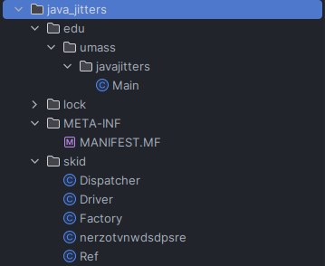

# UMass 2023 - java\_jitters

## Description

> _sips coffee_ o vault of secrets, teller of wisdom and UMastery, tell me the secret phrase and I shall share my wisdom
>
> **File**: [javajitters.jar](https://files.ivyfanchiang.ca/\_umassctf\_java/javajitters.jar)****

The program provided is run in the command line and asks the user to supply a password as an argument, if the password is correct, the program prints out the flag.

## Unpacking the JAR

This is pretty simple, JAR files are just fancy ZIP files with a set directory structure so once you unzip it you get this:

<figure><figcaption></figcaption></figure>

The first thing that you should look at is the `META-INF/MANIFEST.MF` file which defines what class is run by Java when executing the JAR:

```ini
Manifest-Version: 1.0
Main-Class: edu.umass.javajitters.Main
```

This tells us to look at the `main` function within the `Main` class in `edu/umass/javajitters`

## Decompiling the `Main` class

It turns out that the Java code for this application has been obfuscated using [Skidfuscator](https://skidfuscator.dev/), so most Java decompilers fail to decompile the `main` function within this class. For example, the version of Fernflower packaged with IntelliJ decompiled every other function but did this on the `main` function:

```java
public static void main(String[] var0) throws NoSuchAlgorithmException {
        // $FF: Couldn't be decompiled
    }
```

This isn't great as reading through the Java bytecode, you can tell most of the program logic falls within this `main` function. All is not lost though, after trying many other decompilers like Procyon, CFR, and JADX, I found that the version of Fernflower packaged with [Recaf](https://www.coley.software/Recaf/) gives us enough code for us to figure out the rest (which is interesting since JetBrains is the creator of Fernflower so you would think the IntelliJ version is the best/latest version). The [code Recaf gave us](https://files.ivyfanchiang.ca/\_umassctf\_java/Main1.recaf\_fernflower.java) isn't perfect and failed to run no matter how many tweaks I made but we can still figure out the code's logic from it.

I also decompiled [`skid/Factory.class`](https://files.ivyfanchiang.ca/\_umassctf\_java/Factory1.java) and [`skid/nerzotvnwdsdpsre.class`](https://files.ivyfanchiang.ca/\_umassctf\_java/nerzotvnwdsdpsre.java) using IntelliJ's version of Fernflower. (Turns out these two classes and everything under `skid/` is Skidfuscator's helper classes)

## Refactoring the code for my sanity

After painstakingly reading through the whole code, I made a [refactored/annotated version of the source code](https://files.ivyfanchiang.ca/\_umassctf\_java/Main1\_annotated.java).

The first problem when refactoring is that a lot of the Java bytecode uses the [`invokedynamic`](https://en.wikipedia.org/wiki/List\_of\_Java\_bytecode\_instructions) instruction for many function calls which Fernflower hates, decompiling the instruction to something like this:

```java
var175 = var173.opotarbpahmyugec<invokedynamic>(var173, var174);
```

You can sometimes guess what function is being used based on the context and datatypes of the variables but you can look at the bytecode (using IntelliJ or Recaf) to find what function is being called:

```java
ALOAD 173
ILOAD 174
INVOKEDYNAMIC opotarbpahmyugec(Ljava/lang/Object;I)C [
      // handle kind 0x6 : INVOKESTATIC
skid/Ref.dispatch(Ljava/lang/invoke/MethodHandles$Lookup;Ljava/lang/String;Ljava/lang/invoke/MethodType;Ljava/lang/Object;Ljava/lang/Object;Ljava/lang/Object;Ljava/lang/Object;)Ljava/lang/Object;
      // arguments:
      182, 
      "java.lang.StringBuilder", 
      "charAt", 
      "(I)C"
]
ISTORE 175
```

This can by translated by hand into this: (After consulting Java docs to figure out how StringBuilder worked)

```java
var175 = var173.charAt(var174);
```

After tediously doing this for every one of the 66 `invokedynamic` calls you get proper Java code!!!

I also renamed the `0o$Oo$K`, `K0o$KOo$KK`, and `Oo0o$OoOo$OoK` functions into `crypto_func1`, `crypto_func2`, and `xor` respectively.

## Tracing `crypto_func1` and `crypto_func2`

I looked at `crypto_func1` first after realizing it was called very early on in the `main` function. From reading the code and running through it line by line in JShell with the args `crypto_func1("password", 58777307);` (`password` was just a test, `58777307` was a constant from how it was called in `main`), I figured out that the function would SHA-256 hash whatever string was passed to it and then call `crypto_func2`. There is one common code pattern to look at here:

```java
StringBuilder var12 = new StringBuilder("\uB236\u8436\u9636\u4E36\u7036\u7E36\u7836");
int var13 = 0;
int var14 = 0;

for (var9 = 0 ^ var9; var13 < var12.length(); var13 += 1974077748 ^ var9) {
    var14 = var12.codePointAt(var13);
    var14 = ((var14 & (1974138570 ^ var9)) >> (1974077756 ^ var9) | var14 << (1974077746 ^ var9)) & (1974138570 ^ var9);
    var14 ^= 1974076994 ^ var9;
    var14 ^= 1974140119 ^ var9;
    var14 ^= 1974134954 ^ var9;
    var12.setCharAt(var13, (char) var14);
}

String var2 = var12.toString();
```

A similar code block to this with different variables pops up once within `crypto_func1` and very often in `main`. Running through it line by line you will see that it initializes a `StringBuilder` object with ciphertext, does some sort of decryption character by character with `var9` being used as a key, and then converts the decrypted `StringBuilder` to a `String`. This is Skidfuscator's string encryption obfuscation which we can bypass by keeping track of the key variable's value as the program runs.

Tracing through `crypto_func2` in a similar manner, you will find that it just takes the hash that `crypto_func1` generated in `byte[]` form and convert it to a hexadecimal string.

One thing to note is that as another obfuscation method, you won't find `return` statements within these two functions. Instead, you will find [`nerzotvnwdsdpsre`](https://files.ivyfanchiang.ca/\_umassctf\_java/nerzotvnwdsdpsre.java) exceptions being thrown. This is a custom exception created by the obfuscator that looks like this:

```java
public class nerzotvnwdsdpsre extends RuntimeException {
    private String var;

    public nerzotvnwdsdpsre(String var1) {
        this.var = var1;
    }

    public String get() {
        return this.var;
    }
}
```

This exception gets used like this to simulate `return` statements:

```java
try {
    while (true) {
        crypto_func2(var5, 503562056);
    }
} catch (nerzotvnwdsdpsre var17) {
    String var6 = var17.get(); // returned value from crypto_func2
    throw new nerzotvnwdsdpsre(var6);  // throwing new exception for crypto_func1's return
}
```

([JShell](https://docs.oracle.com/javase/9/jshell/introduction-jshell.htm#JSHEL-GUID-630F27C8-1195-4989-9F6B-2C51D46F52C8) for the uninitiated, is Java's secret REPL shell which allows you to test Java code in an interpreter like Python's interpreter)

## Analyzing `main`

With those two functions out of the way, lets start analyzing the main program code. First we have to find the key which I've called `int1`:

```java
int int1 = 1800875868 ^ 2076430062 ^ gjMAozlvk2;
int1 = 841098174 ^ int1;
```

This key is initialized with a seeded random number generator:

```java
int var3 = (new Random(-8261172285046822504L)).nextInt();  // = -535977286
gjMAozlvk2 = -266593489 ^ var3;  // = 269597077
```

This means our key starts with the value `849836953`.

The program starts by checking that a password is supplied, then over a series of calculations (traced through JShell), the key changes to `2024113895`. Throughout these calculations, functions in the `Factory` helper class are called which appear to be a checksum function to make sure that the key is correct throughout the program's execution. The program then calls `crypto_func1(str2, 58777307)` to SHA-256 hash our password.

The rest of the program is a series of nested if-else blocks which do the following:

1. Performs a XOR calculation against some integer literal to calculate a new key
2. Decrypts a SHA-256 of a known hash (using the method outlined above)
3. Compares that hash against the user's password hash
4. If the hashes match:
   1. Performs a XOR calculation against some integer literal to calculate a new key again
   2. Decrypts a message to output to the user (using the method outlined above)
   3. Prints out the message
   4. Exits the program
5. If the hashes don't match, do more XOR calculations and `Factory` checksums to change up the key and repeat

There are many known passwords as some output easter egg messages like `Congratulations, you've unlocked the secret to a perfect cup of Java!`. If none of the passwords match the last else block prints a password not found message.

Tracing the program in JShell, halfway into the code we get to a block where the key is `1140202191`and a SHA-256 hash of `8900fbb69012f45062aa6802718ad464eaea0854b66fe8916b3b38e775c296a8`.

```java
StringBuilder var168 = new StringBuilder("\uA849\uB849\u2849\u2849\u884C\u484C\u484C\u8849\uB849\u2849\u3849\u4849\u884C\u6849\u7849\u2849\u8849\u4849\u384C\u384C\u8849\uA849\u2849\u4849\u9849\u3849\uA849\u384C\u684C\u6849\u8849\u6849\u784C\u384C\u784C\u384C\u2849\uA849\u7849\u6849\u484C\u8849\u8849\u884C\u784C\uA849\uB849\u3849\u8849\u484C\u5849\u484C\u5849\uA849\u784C\u9849\u9849\u7849\u584C\u4849\uB849\u8849\u384C\uA849");
int var169 = 0;
int var170 = 0;

for (int1 = 0 ^ int1; var169 < var168.length(); var169 += 1140202190 ^ int1) {
    var170 = var168.charAt(var169);
    var170 += 1140203535 ^ int1;
    var170 = ((var170 & (1140254000 ^ int1)) << (1140202186 ^ int1) | var170 >> (1140202180 ^ int1)) & (1140254000 ^ int1);
    var170 = ((var170 & (1140254000 ^ int1)) << (1140202176 ^ int1) | var170 >> (1140202190 ^ int1)) & (1140254000 ^ int1);
    var170 -= 1140197327 ^ int1;
    var170 -= 1140197801 ^ int1;
    var168.setCharAt(var169, (char) var170);
}

String var46 = var168.toString();  // 8900fbb69012f45062aa6802718ad464eaea0854b66fe8916b3b38e775c296a8
byte var14 = (byte) (var6.equals(var46) ? 1 : 0);  // var6.equals(var46);
if (var14 != (1140202191 ^ int1)) {
    int1 = 850230892 ^ int1;  // 1901814947
    PrintStream var15 = System.out;
    StringBuilder var188 = new StringBuilder("\u1b2a\u1bea\u1b8a\u9b0a\u9b0a\u9a4a\u9b8a\u580a\udaaa\udaaa\u980a\u980a\u9b6a\u1aea\u5b8a\u9aca\u980a\u9a0a\u9b6a\u1aea\u980a\u9b6a\udbca\u5b8a\uda2a\u5b8a\u9b6a\u9a8a\uda0a\u1a8a\uda4a\u1a4a\u1a6a");
    int var189 = 0;
    int var190 = 0;

    for (int1 = 0 ^ int1; var189 < var188.length(); var189 += 1901814946 ^ int1) {
        var190 = var188.charAt(var189);
        var190 = ((var190 & (1901828956 ^ int1)) << (1901814952 ^ int1) | var190 >> (1901814950 ^ int1)) & (1901828956 ^ int1);
        var190 ^= 1901840784 ^ int1;
        var190 = ((var190 & (1901828956 ^ int1)) >> (1901814959 ^ int1) | var190 << (1901814951 ^ int1)) & (1901828956 ^ int1);
        var190 = (var190 ^ -1901814948 ^ int1) & ((1901814946 ^ int1) << (1901814963 ^ int1)) - (1901814946 ^ int1);
        var190 ^= ((var190 >> (1901814952 ^ int1) ^ var190 >> (1901814947 ^ int1)) & ((1901814946 ^ int1) << (1901814951 ^ int1)) - (1901814946 ^ int1)) << (1901814952 ^ int1) | ((var190 >> (1901814952 ^ int1) ^ var190 >> (1901814947 ^ int1)) & ((1901814946 ^ int1) << (1901814951 ^ int1)) - (1901814946 ^ int1)) << (1901814947 ^ int1);
        var190 = ((var190 & (1901828956 ^ int1)) >> (1901814945 ^ int1) | var190 << (1901814957 ^ int1)) & (1901828956 ^ int1);
        var188.setCharAt(var189, (char) var190);
    }

    String var47 = var188.toString();
    println15(var15, var47, 862983464);
    int1 = 1019968462 ^ int1;

    try {
        if (Factory.method1(int1) != 105345395) {  // int1.mcaysezmbpdkwegq<invokedynamic>(int1)
            throw null;
        }

        throw new IllegalAccessException();
    } catch (IllegalAccessException var221) {
        switch (Factory.method2(int1)) {
            case 1603759402:
                int1 = xor(int1, 1207713573);  // int1.mnumuswfopdwpjwp<invokedynamic>(int1, 1207713573);
                break;
            case 1820392298:
                int1 = 1100926445 ^ int1;
                break;
            default:
                throw new RuntimeException("Error in hash");
        }
    }

    while (true) {
        switch (Factory.method1(int1)) {
            case 37686904:
            default:
                throw new RuntimeException();
            case 123517910:
                int1 = 982632165 ^ int1;
                return;
            case 691634510:
                break;
            case 1995906324:
                return;
        }
    }
} else {
    ...
```

Decrypting the message of this block, we get our flag: `UMASS{C0ff33_m@k3s_m3_J@v@_crazy}`

All the source code that was relevant for both java\_jitters and java\_jitters\_v2 in decompiled and annotated/refactored forms can be found [here](https://files.ivyfanchiang.ca/\_umassctf\_java/), the writeup for this problem's sequel `java_jitters_2` can be found [here](umass-2023-java\_jitters\_2.md)
